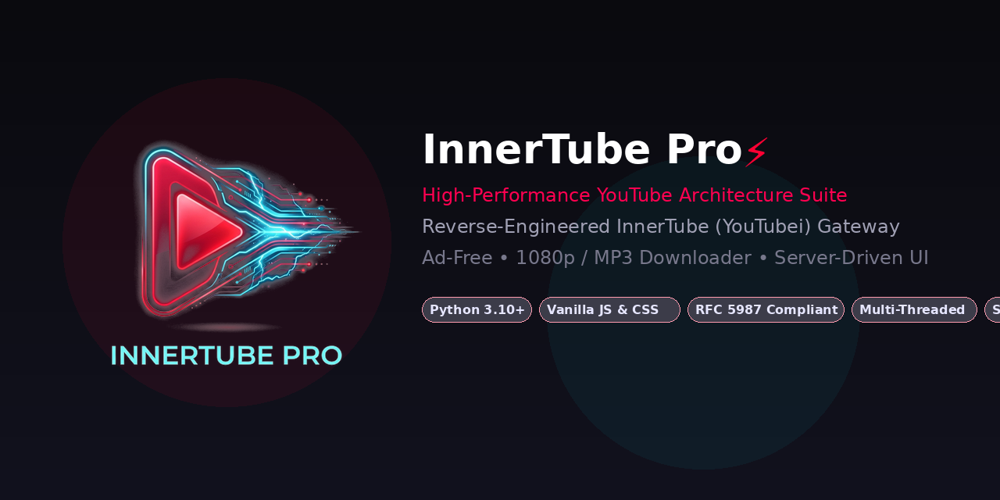
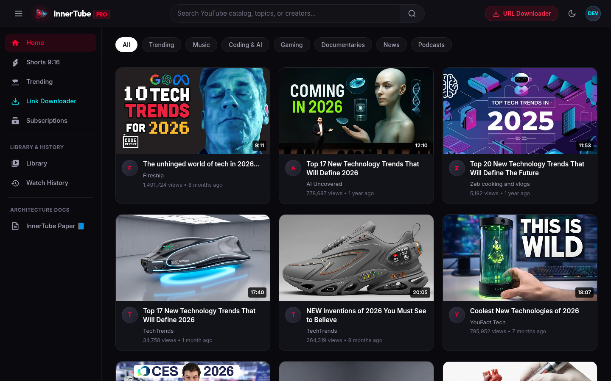
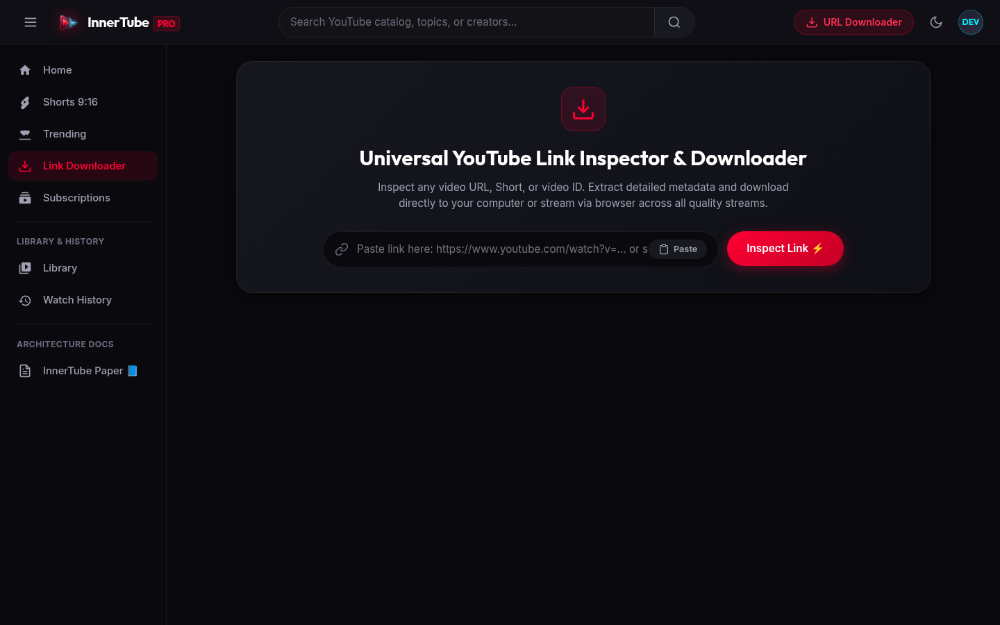

<p align="center">
  
</p>

<p align="center">
  <a href="https://python.org"></a>
  <a href="LICENSE"></a>
  <a href="docs/INNERTUBE_INTERNAL_ARCHITECTURE.md"></a>
  <a href="https://datatracker.ietf.org/doc/html/rfc5987"></a>
  <a href="#concurrency-model"></a>
</p>

---

## 📖 Overview

**InnerTube Pro** is an open-source, full-stack reverse engineering suite and streaming client built directly on top of Google's internal **InnerTube (YouTubei)** API protocol. It serves as both an educational case study into modern **Server-Driven UI (SDUI)** systems and a high-performance, ad-free web platform featuring infinite scroll pagination, vertical Shorts playback, arbitrary URL inspection, and multi-quality media downloading (1080p Full HD, 720p HD, 480p, 360p, 320kbps MP3, M4A).

> [!NOTE]
> For an exhaustive, in-depth architectural breakdown of YouTube's internal component renderers, continuation tokens, itag formats, and cipher mechanisms, please read our dedicated whitepaper:  
> **[📘 InnerTube Internal Architecture & Protocol Engineering](docs/INNERTUBE_INTERNAL_ARCHITECTURE.md)**

---

## 📸 Visual Showcase & Previews

<p align="center">
  
  
</p>

---

## 🚀 Key Engineering Highlights

* **Pure Vanilla Architecture**: 100% lightweight Vanilla CSS and Vanilla JavaScript with zero heavy framework overhead (No React, Vue, or Angular bundle bloat).
* **Recursive Renderer Traversal Engine**: Navigates YouTube's deeply-nested (up to 16-level) JSON response trees dynamically without hardcoded assumptions.
* **Continuation Token Pagination**: Replicates YouTube's Protobuf-based continuous feed pagination with an intelligent qualifier fallback engine.
* **RFC 5987 / RFC 6266 Internationalization**: Full standard-compliant UTF-8 HTTP Content-Disposition headers supporting international characters (Arabic, Cyrillic, CJK, Emoji) without `latin-1` socket crashes.
* **Non-Blocking Multi-Threaded Daemon**: Powered by Python's `ThreadingHTTPServer`, ensuring long-running FFMPEG transcode operations never stall UI queries or streaming downloads.
* **Instant Dynamic Caching**: Sub-second deduplication detects already-downloaded media in `~/Downloads`, returning existing assets in **0.003s**.

---

## 🎨 User Interface & Experience

1. **Dashboard Feed**: Search across the live YouTube catalog with infinite scroll.
2. **Shorts Cinema**: Vertical (9:16) reel viewer tailored for seamless continuous consumption.
3. **Trending Categories**: Real-time trending feeds categorized into General, Music, Gaming, and News.
4. **Channel Explorer**: Channel profile viewer with subscriber counts, metadata, and video catalogs.
5. **Universal Link Downloader**: Paste any YouTube link, short URL (`youtu.be`), or video ID to instantly inspect metadata and trigger multi-quality downloads.
6. **Cinema Watch Room**: Ambient dark theater with synchronized recommendations, channel information, and live comment feeds.
7. **Floating PiP Player**: Mini-player allowing background listening while browsing other tabs.

---

## 🛠️ Architecture & System Design

```
                     ┌─────────────────────────────────────────┐
                     │            Client Browser               │
                     │  (Vanilla JS + Luxury Dark CSS Glass)   │
                     └────────────────────┬────────────────────┘
                                          │ HTTP / JSON
                                          ▼
                     ┌─────────────────────────────────────────┐
                     │     InnerTube Pro Multi-Threaded Hub    │
                     │      (http.server.ThreadingHTTPServer)  │
                     └───────┬─────────────────────────┬───────┘
                             │                         │
            ┌────────────────┴──────────┐   ┌──────────┴──────────┐
            ▼                           ▼   ▼                     ▼
┌───────────────────────┐   ┌───────────────────────┐   ┌───────────────────────┐
│ InnerTube Search API  │   │  InnerTube Shorts API │   │ Multi-Quality Engine  │
│ (/youtubei/v1/search) │   │ (/youtubei/v1/browse) │   │ (yt-dlp + ffmpeg mux) │
└───────────┬───────────┘   └───────────┬───────────┘   └───────────┬───────────┘
            │                           │                           │
            └───────────────────────────┼───────────────────────────┘
                                        ▼
                     ┌─────────────────────────────────────────┐
                     │       Google Global Cache (GGC)         │
                     │         & DASH Stream Clusters          │
                     └─────────────────────────────────────────┘
```

---

## 📦 Installation & Quick Start

### Prerequisites
* Python 3.10 or higher
* `ffmpeg` installed on your system (`sudo apt install ffmpeg` on Ubuntu/Debian)

### 1. Clone & Setup
```bash
git clone https://github.com/Kenandarabeh/youtube-innertube-pro.git
cd youtube-innertube-pro
pip install -r requirements.txt
```

### 2. Launch the Application
```bash
chmod +x run.sh
./run.sh
```
Or directly with Python:
```bash
python3 server.py
```

### 3. Open in Browser
Visit **`http://127.0.0.1:5050`** in any modern web browser.

---

## 📡 REST API Reference

| Method | Endpoint | Query Parameters | Description |
| :---: | :---: | :---: | :--- |
| `GET` | `/api/search` | `q`, `continuation`, `page` | Queries YouTube with recursive tree parsing & infinite pagination |
| `GET` | `/api/shorts` | `q`, `continuation` | Fetches vertical video feed with reel endpoint extraction |
| `GET` | `/api/trending` | `tab` (`general`, `music`, `gaming`, `news`), `page` | Returns real-time category trending catalogs |
| `GET` | `/api/related` | `id`, `q` | Returns Up-Next recommended videos for the cinema player |
| `GET` | `/api/channel` | `name`, `continuation`, `page` | Returns video catalog and profile data for any channel |
| `GET` | `/api/inspect_link` | `url` | Universal parser inspecting any YouTube link into 6 download options |
| `GET` | `/api/download_local`| `id`, `type`, `quality`, `title` | Downloads media directly to user's computer (`~/Downloads`) |
| `GET` | `/api/stream_download`| `id`, `type`, `quality`, `title` | Direct browser download with RFC 5987 international headers |
| `GET` | `/api/download` | `id`, `title` | Returns quality matrix metadata for the download modal |
| `GET` | `/api/sponsorblock` | `id` | Fetches crowdsourced sponsor skip segments from SponsorBlock |

---

## 🛠️ Developer CLI & Diagnostics Suite

InnerTube Pro includes a standalone terminal utility and automated health suite under `tools/`:

### 1. Terminal CLI (`tools/cli.py`)
```bash
# Inspect any video, extracting all stream itags and metadata
python3 tools/cli.py inspect "https://www.youtube.com/watch?v=0e3GPea1Tyg"

# Download 1080p directly to ~/Downloads via terminal
python3 tools/cli.py download "0e3GPea1Tyg" --quality 1080p

# Query SponsorBlock skip segments directly
python3 tools/cli.py sponsorblock "0e3GPea1Tyg"
```

### 2. Automated Gateway Diagnostics (`tools/test_innertube.py`)
Benchmark InnerTube latency, FFMPEG muxing, and RFC 5987 compliance:
```bash
python3 tools/test_innertube.py
```

---

## 🤝 Contributing & Extending

We welcome contributions! Please review our **[Contributing Guide](CONTRIBUTING.md)** for architecture maps and step-by-step instructions on implementing new InnerTube endpoints.

---

## ⚖️ Legal Disclaimer & Safe Harbor

This repository is developed strictly for **educational, architectural analysis, and network protocol research** (Interoperability & Network Protocol Study). 

* This project does not circumvent access controls or decrypt DRM-protected content (such as Widevine Modular DRM).
* Public YouTube streams do not employ technological protection measures under Section 1201 of the Digital Millennium Copyright Act (DMCA).
* All trademarks, video assets, and logos belong to YouTube, LLC / Google LLC.
* Please consult YouTube's Terms of Service for commercial deployment considerations.

---

## 📄 License

Distributed under the **MIT License**. See `LICENSE` for more information.
